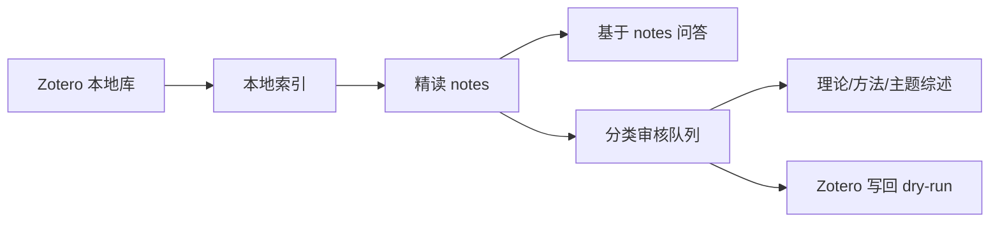

<p align="center">
  <a href="./README.md"><strong>中文</strong></a>
  ·
  <a href="./README_EN.md">English</a>
</p>

<h1 align="center">MindCite</h1>

<p align="center">
  <strong>把 Zotero 论文库变成一个可追溯、可复用、可扩展的本地研究工作台。</strong>
</p>

<p align="center">
  <a href="https://github.com/YYCCCHAOOO/MindCite/releases/tag/v0.2.0"></a>
  
  
  
  
</p>

> 推荐方式：优先使用 **Codex 智能部署**；熟悉命令行的用户再看 **快速开始**。

MindCite 是一个面向研究者的本地文献工作流模板，用来把 Zotero、Obsidian 和 Codex 串成一条可复用的研究管线：先从 Zotero 建立本地索引，再把论文原文或全文缓存整理为结构化精读笔记，最后基于已生成的 notes 做问答、分类治理和理论/方法综述。

这个公开版是安全模板，不包含任何真实论文、真实索引、真实 Zotero 数据库、API key 或个人研究材料。仓库里的 `examples/demo-vault` 是完全虚构的演示数据，只用于试跑功能。

## 选择你的启动方式

| 如果你是 | 推荐入口 | 适合场景 |
| --- | --- | --- |
| Codex 用户 | [Codex 智能部署指令](#codex-智能部署指令) | 让 Codex 自动拉库、配置、检查并只读连接 Zotero。 |
| 0 代码用户 | [Codex 指令手册](docs/codex-command-cookbook.md) | 直接复制自然语言指令，让 Codex 代替你操作。 |
| 命令行用户 | [快速开始](#快速开始) | 自己复制命令并手动配置 `.env`。 |
| 先看效果 | [5 分钟体验路径](#5-分钟体验路径) | 不配置真实 Zotero 和 API key，只跑合成 demo。 |
| 想做分类 | [分类指南](docs/classification-guide.md) | 理解 theory/method/topic、审核队列和 Zotero dry-run。 |

## 工作流一览



## 项目主题

把 Zotero 论文库变成一个可追溯、可复用、可扩展的本地研究工作台。

MindCite 的核心不是“让 AI 替你读完所有论文”，而是帮你建立一条更稳的研究管线：Zotero 负责资料管理，Obsidian 负责长期沉淀，Codex 负责把重复的索引、精读、分类、检查和综述草稿自动化。

## 核心亮点

- 本地优先：真实 PDF、Zotero 数据库、API key、日志和个人研究笔记默认不进仓库。
- 可追溯：从 Zotero 索引到精读 notes，再到分类审核和综述草稿，每一步都有文件输出。
- 可试跑：内置 `examples/demo-vault` 合成演示数据，刚下载就能验证主流程。
- 可扩展：模型厂商、embedding、模板、分类维度和外部数据库都通过配置层扩展。
- 可守底线：v0.2 起加入 schema 校验、原子写入、迁移 dry-run、quarantine 和 smoke test。
- 面向研究者：重点服务“持续阅读、分类治理、理论/方法积累、后续论文写作”，不是一次性的聊天问答。

## 适合谁

- 你用 Zotero 管理论文，并希望把阅读结果沉淀到 Obsidian。
- 你想用 Codex 或其他 AI coding agent 帮你自动跑索引、精读、分类和综述。
- 你希望保留本地知识库能力，但不想把 Zotero 数据库、PDF、未发表论文和 API key 上传到云端。

## 不适合谁

- 你只想要一个无需配置、打开网页就能用的在线工具。
- 你还没有 Zotero 或 Obsidian 的基本使用习惯。
- 你希望把整库论文和私人研究资料直接上传到 GitHub 或云端。
- 你期待 AI 自动替代研究判断，而不是辅助整理、检索和生成草稿。

## 5 分钟体验路径

如果你只是先体验，不需要配置真实 Zotero 路径和 API key，直接跑合成演示数据：

```powershell
git clone https://github.com/YYCCCHAOOO/MindCite.git MindCite
cd MindCite
python -m pip install -r requirements.txt
python tools/structure_check.py
python tools/validate_data_contracts.py --demo-only
$env:MINDCITE_ROOT=(Resolve-Path .\examples\demo-vault)
python _skills/Zotero-Library-Sync/scripts/vault_health_check.py
python _skills/Classification-Governance-System/scripts/build_classification_review_queue.py --all
Remove-Item Env:\MINDCITE_ROOT
```

看到 `ok: true` 就说明本地结构、演示索引和分类审核队列都能正常跑通。之后再复制 `.env.example`，填自己的 Zotero 路径和模型 key。

## 目录结构

```text
MindCite/
  _skills/                         # Codex 可读取的工作流技能与脚本
  config/                          # 通用配置模板
  docs/                            # 架构、Codex 配置、排障文档
  examples/demo-vault/             # 合成演示 Vault，不含真实研究信息
  indexes/                         # 运行时索引输出，默认不提交
  logs/                            # 运行日志，默认不提交
  migrations/                      # 数据结构迁移脚本
  notes/zotero_reading/_papers/    # 新版精读笔记输出，默认不提交
  schemas/                         # 核心数据契约
  templates/                       # 可放你的公开模板
  tools/                           # 发布安全检查工具
```

## Codex 智能部署指令

如果你使用 Codex，推荐先不要手动配置。新建一个本地工作区后，直接复制下面这段话给 Codex：

```text
请从 https://github.com/YYCCCHAOOO/MindCite 拉取仓库，帮我创建一个私有 MindCite Vault。请自动完成依赖安装、配置文件复制、结构检查和 demo smoke test。然后只读探测我的本机 Zotero 数据库和 storage 路径，写入本地 .env，并运行 update_zotero_index.py 生成本地索引。不要提交 .env、indexes、logs、notes、PDF、Zotero 数据库或任何 API key；不要执行任何 --apply；如果只是测试精读通路，请设置 MINDCITE_OFFLINE=1，避免调用远程模型。
```

Codex 应该完成：

- 克隆仓库并进入项目目录。
- 复制 `.env.example` 和 `config/mindcite.example.json`。
- 安装 `requirements.txt`。
- 运行 `python tools/structure_check.py` 和 `python tools/smoke_test.py`。
- 只读探测 `ZOTERO_DB_PATH` 与 `ZOTERO_STORAGE_PATH`。
- 生成本地 Zotero 索引，但不写回 Zotero。

更多 Codex 配置细节见 [Codex Setup](docs/codex-setup.md)。

如果你没有代码基础，建议直接看 [Codex 指令手册](docs/codex-command-cookbook.md)，里面按“部署、更新索引、精读、问答、分类、综述、安全检查”整理了可复制的自然语言指令。

## 快速开始

1. 克隆仓库并进入目录。

```powershell
git clone https://github.com/YYCCCHAOOO/MindCite.git MindCite
cd MindCite
```

2. 创建本地配置文件。

```powershell
Copy-Item .env.example .env
Copy-Item config/mindcite.example.json config/mindcite.json
```

3. 编辑 `.env`。至少建议填写：

```text
ZOTERO_DB_PATH=<你的 Zotero 本地数据库文件路径>
ZOTERO_STORAGE_PATH=<你的 Zotero storage 文件夹路径>
MINDCITE_LLM_PROVIDER=deepseek
MINDCITE_EMBEDDING_PROVIDER=siliconflow
DEEPSEEK_API_KEY=<你的 DeepSeek API key>
SILICONFLOW_API_KEY=<你的 SiliconFlow API key>
```

如果你只是先看演示，不需要填写真实 Zotero 路径和 API key。

4. 安装 Python 依赖。

```powershell
python -m pip install -r requirements.txt
```

5. 做一次结构和安全检查。

```powershell
python tools/structure_check.py
python tools/validate_data_contracts.py --demo-only
```

6. 运行空 Vault 健康检查。

```powershell
python _skills/Zotero-Library-Sync/scripts/vault_health_check.py
```

7. 用合成演示数据试跑。

```powershell
$env:MINDCITE_ROOT=(Resolve-Path .\examples\demo-vault)
python _skills/Zotero-Library-Sync/scripts/vault_health_check.py
python _skills/Classification-Governance-System/scripts/build_classification_review_queue.py --all
Remove-Item Env:\MINDCITE_ROOT
```

## 三条主流程

### 1. 更新 Zotero 索引

索引脚本会只读连接 Zotero 本地数据库，生成 `indexes/zotero_library_index.jsonl`，并尝试记录 PDF、全文缓存、Zotero 分类和已有阅读状态。

```powershell
python _skills/Zotero-Reading-System/scripts/update_zotero_index.py
```

如果报错 `No readable Zotero database found`，说明 `.env` 里的 `ZOTERO_DB_PATH` 还没有配置，或路径不可读。

### 2. 精读文献生成 notes

精读主流程默认优先使用 Zotero 全文缓存；没有缓存时再回退 PDF。生成的新版笔记进入 `notes/zotero_reading/_papers`，阅读状态进入 `logs/reading_status.jsonl`。

```powershell
python _skills/Zotero-Reading-System/scripts/zotero_ai_reading_pipeline.py --next-count 2
```

也可以指定 Zotero item key：

```powershell
python _skills/Zotero-Reading-System/scripts/zotero_ai_reading_pipeline.py --item-keys ABC12345,XYZ67890
```

### 3. 基于 notes 回答问题

`Notes-QA-System` 的原则是只使用已经生成的新版本 notes，不回头扫描 Zotero note、批注或旧版笔记。这样可以保证回答来源稳定、可追溯。

在 Codex 中可以直接说：

```text
根据已精读笔记，总结金融传染理论下的核心机制。
```

如果当前 notes 证据不足，agent 应明确说明“当前新版 notes 中证据不足”。

## 分类治理与综述流程

分类是 MindCite 中最复杂、也最值得谨慎使用的模块。详细说明见 [分类指南](docs/classification-guide.md)。建议先按指南生成审核队列和 dry-run，不要一开始就写回 Zotero。

### 健康检查

```powershell
python _skills/Zotero-Library-Sync/scripts/vault_health_check.py
```

输出：

- `indexes/vault_health_report.md`
- `indexes/orphan_notes.jsonl`

### 分类审核队列

```powershell
python _skills/Classification-Governance-System/scripts/build_classification_review_queue.py --all
```

输出：

- `indexes/classification_review_queue.jsonl`

### 标签体系审计

```powershell
python _skills/Classification-Governance-System/scripts/build_tag_taxonomy_proposal.py
python _skills/Classification-Governance-System/scripts/build_tag_taxonomy_audit.py
```

### Zotero 写回

写回功能默认是 dry-run。只有显式传 `--apply` 才会真实写入，并且 SQLite 写回会先备份数据库。公开版建议先只生成 dry-run 文件，不要急着写回。

```powershell
python _skills/Classification-Governance-System/scripts/build_zotero_writeback_dryrun.py
python _skills/Classification-Governance-System/scripts/apply_zotero_writeback_sqlite.py --limit 5
```

真实写回前请先关闭 Zotero，并确认你已经备份本地数据库。

### 理论/方法/主题综述

```powershell
python _skills/Theory-Method-Synthesis-System/scripts/build_classification_synthesis.py --dimension theory --tag 金融传染
```

综述草稿默认写入 `notes/classification_synthesis`。

## 配置说明

公开版所有路径都通过 `.env`、`config/mindcite.json` 或系统环境变量读取：

- `MINDCITE_ROOT`：Vault 根目录；不填时默认当前仓库。
- `ZOTERO_DB_PATH`：Zotero 本地数据库文件路径。
- `ZOTERO_SNAPSHOT_DB_PATH`：可选的只读数据库快照路径。
- `ZOTERO_STORAGE_PATH`：Zotero storage 文件夹路径，用来寻找 PDF 和全文缓存。
- `MINDCITE_LLM_PROVIDER`：生成模型厂商，可选 `deepseek`、`openai`、`qwen`、`zhipu`、`custom`。
- `MINDCITE_EMBEDDING_PROVIDER`：embedding 厂商，可选 `siliconflow`、`openai`、`custom`。
- `DEEPSEEK_API_KEY` / `OPENAI_API_KEY` / `DASHSCOPE_API_KEY` / `ZHIPU_API_KEY`：对应厂商的生成模型 key。
- `SILICONFLOW_API_KEY`：SiliconFlow embedding key；如果 embedding 也使用 OpenAI，则复用 `OPENAI_API_KEY`。
- `MINDCITE_CONFIG`：可选的自定义配置文件路径。

LLM 与 embedding 的厂商、base URL、默认模型配置在 `_skills/Zotero-Reading-System/config/reader_config.json`。你可以通过 `.env` 改 `*_MODEL` 变量，也可以在 `reader_config.json` 里新增 OpenAI-compatible 厂商；真实 key 不要写进配置文件，只放 `.env` 或系统环境变量。

### 模型厂商示例

| 用途 | `provider` | 默认模型变量 | API key 变量 |
| --- | --- | --- | --- |
| 生成 | `deepseek` | `DEEPSEEK_MODEL=deepseek-chat` | `DEEPSEEK_API_KEY` |
| 生成 | `openai` | `OPENAI_MODEL=gpt-4o-mini` | `OPENAI_API_KEY` |
| 生成 | `qwen` | `DASHSCOPE_MODEL=qwen-plus` | `DASHSCOPE_API_KEY` |
| 生成 | `zhipu` | `ZHIPU_MODEL=glm-4-flash` | `ZHIPU_API_KEY` |
| 生成 | `custom` | `MINDCITE_LLM_MODEL` | `MINDCITE_LLM_API_KEY` |
| Embedding | `siliconflow` | `SILICONFLOW_EMBEDDING_MODEL=BAAI/bge-m3` | `SILICONFLOW_API_KEY` |
| Embedding | `openai` | `OPENAI_EMBEDDING_MODEL=text-embedding-3-small` | `OPENAI_API_KEY` |
| Embedding | `custom` | `MINDCITE_EMBEDDING_MODEL` | `MINDCITE_EMBEDDING_API_KEY` |

## 安全底座

v0.2.0 开始，MindCite 把长期扩展风险显式拆出来：

- `schemas/`：定义 index、reading status、note frontmatter、taxonomy、review queue 的数据契约。
- `_skills/common/safe_io.py`：提供原子写入、备份和 quarantine。
- `tools/validate_data_contracts.py`：校验 demo 或真实 Vault 是否符合当前契约。
- `tools/migrate.py`：默认 dry-run，把旧数据升级到当前 `schema_version`。
- `tools/smoke_test.py`：用 demo-vault 跑一遍回归检查。

推荐在新增功能或迁移真实 Vault 前执行：

```powershell
python tools/migrate.py --dry-run
python tools/smoke_test.py
```

真实迁移才使用：

```powershell
python tools/migrate.py --apply
```

扩展新功能前，请先看 `docs/extension-policy.md`。

## 常见问题

**没有 PDF 怎么办？**  
精读流程会把条目标记为 `needs_pdf`，你补齐 PDF 或 Zotero 全文缓存后再继续。

**没有全文缓存怎么办？**  
脚本会尝试回退到 PDF。若 PDF 也没有，就跳过并写日志。

**API key 失败怎么办？**  
先确认 `.env` 是否存在、变量名是否正确、终端是否在仓库根目录运行。再确认 provider 额度和网络访问。

**中文路径可以用吗？**  
可以，但建议 PowerShell 命令使用引号包住路径，Python 文件读写统一使用 UTF-8。

**我可以直接上传自己的 Vault 吗？**  
不建议。请使用这个公开模板，再把自己的真实 notes、indexes、logs、PDF 和数据库留在本地。
