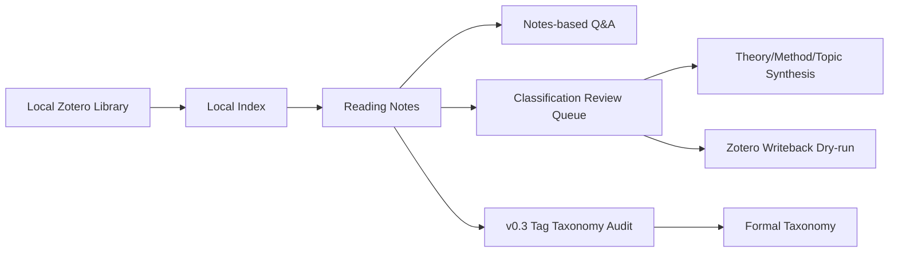

<p align="center">
  <a href="./README.md"><strong>中文</strong></a>
  ·
  <a href="./README_EN.md">English</a>
</p>

<h1 align="center">MindCite</h1>

<p align="center">
  <strong>A local-first research workflow template for Zotero, Obsidian, and Codex.</strong>
</p>

<p align="center">
  <a href="https://github.com/YYCCCHAOOO/MindCite/releases/tag/v0.3.0"></a>
  
  
  
  
</p>

> Recommended path: use **Codex smart deployment** first. If you are comfortable with the command line, use **Quick Start**.

MindCite turns a local Zotero library into a traceable, reusable, and extensible research workspace. It builds a local index from Zotero, generates structured reading notes for Obsidian, and supports note-based Q&A, classification governance, and theory/method/topic synthesis.

This public template contains no real papers, Zotero databases, API keys, private indexes, logs, or personal research materials. `examples/demo-vault` is fully synthetic and only exists for testing the workflow.

## Choose Your Path

| You are | Start here | Best for |
| --- | --- | --- |
| A Codex user | [Codex Smart Deploy](#codex-smart-deploy) | Let Codex clone, configure, test, and connect to Zotero in read-only mode. |
| A no-code user | [Codex Command Cookbook](docs/codex-command-cookbook.md) | Copy natural-language prompts and let Codex operate the workflow. |
| A command-line user | [Quick Start](#quick-start) | Configure `.env` and run commands manually. |
| Just exploring | [5-Minute Demo](#5-minute-demo) | Run synthetic demo data without Zotero paths or API keys. |
| Working on classification | [Classification Guide](docs/classification-guide.md) | Understand theory/method/topic tags, review queues, and Zotero dry-run. |

## Workflow



## Highlights

- Local-first: PDFs, Zotero databases, API keys, logs, and private notes stay local by default.
- Traceable: Zotero index, reading notes, classification queues, and synthesis drafts are all file-based.
- Demo-ready: `examples/demo-vault` lets you test the workflow immediately.
- Extensible: LLM providers, embeddings, templates, classification dimensions, and data sources are configurable.
- Safer long-term work: v0.2 adds schema validation, atomic writes, migration dry-runs, quarantine, and smoke tests.
- Better classification governance: v0.3 audits the tag system itself with `a/p/m/r` decisions for accept, pending, merge, and reject.

## Who This Is For

- You manage papers with Zotero and want to persist reading outputs in Obsidian.
- You want Codex or another AI coding agent to automate indexing, reading, classification, and synthesis.
- You want a local knowledge workflow without uploading unpublished research, Zotero databases, PDFs, or API keys.

## Who This Is Not For

- You want a zero-setup web app.
- You do not use Zotero or Obsidian yet.
- You want to upload your entire private Vault to GitHub or a cloud service.
- You expect AI to replace research judgment instead of assisting organization and drafting.

## 5-Minute Demo

Run the synthetic demo without real Zotero paths or API keys:

```powershell
git clone https://github.com/YYCCCHAOOO/MindCite.git MindCite
cd MindCite
python -m pip install -r requirements.txt
python tools/structure_check.py
python tools/validate_data_contracts.py --demo-only
$env:MINDCITE_ROOT=(Resolve-Path .\examples\demo-vault)
python _skills/Zotero-Library-Sync/scripts/vault_health_check.py
python _skills/Classification-Governance-System/scripts/build_classification_review_queue.py --all
python _skills/Classification-Governance-System/scripts/discover_open_tag_candidates.py --min-notes 1
python _skills/Classification-Governance-System/scripts/prioritize_open_tag_candidates.py
python _skills/Classification-Governance-System/scripts/apply_tag_taxonomy_decisions.py --use-markdown-operations
Remove-Item Env:\MINDCITE_ROOT
```

If you see `ok: true`, the project structure, demo index, and classification queue are working.

## Codex Smart Deploy

If you use Codex, create a local workspace and paste this prompt:

```text
Please clone https://github.com/YYCCCHAOOO/MindCite and create a private local MindCite Vault for me. Install dependencies, copy config templates, run structure checks and the demo smoke test. Then detect my local Zotero database and storage paths in read-only mode, write them to local .env, and run update_zotero_index.py to generate a local index. Do not commit .env, indexes, logs, notes, PDFs, Zotero databases, or API keys. Do not run any --apply command. If testing the reading pipeline only, set MINDCITE_OFFLINE=1 to avoid remote model calls.
```

Codex should:

- Clone the repository.
- Copy `.env.example` and `config/mindcite.example.json`.
- Install `requirements.txt`.
- Run `python tools/structure_check.py` and `python tools/smoke_test.py`.
- Detect `ZOTERO_DB_PATH` and `ZOTERO_STORAGE_PATH` in read-only mode.
- Build a local Zotero index without writing back to Zotero.

See [Codex Setup](docs/codex-setup.md) for details.

If you have no coding background, start with the [Codex Command Cookbook](docs/codex-command-cookbook.md). It provides copy-ready prompts for deployment, indexing, reading, Q&A, classification, synthesis, and safety checks.

## Quick Start

1. Clone the repository.

```powershell
git clone https://github.com/YYCCCHAOOO/MindCite.git MindCite
cd MindCite
```

2. Create local config files.

```powershell
Copy-Item .env.example .env
Copy-Item config/mindcite.example.json config/mindcite.json
```

3. Edit `.env`.

```text
ZOTERO_DB_PATH=<your Zotero sqlite path>
ZOTERO_STORAGE_PATH=<your Zotero storage folder>
MINDCITE_LLM_PROVIDER=deepseek
MINDCITE_EMBEDDING_PROVIDER=siliconflow
DEEPSEEK_API_KEY=<your DeepSeek API key>
SILICONFLOW_API_KEY=<your SiliconFlow API key>
```

4. Install dependencies.

```powershell
python -m pip install -r requirements.txt
```

5. Run checks.

```powershell
python tools/structure_check.py
python tools/validate_data_contracts.py --demo-only
```

## Main Workflows

### 1. Update Zotero Index

```powershell
python _skills/Zotero-Reading-System/scripts/update_zotero_index.py
```

This reads the local Zotero database in read-only mode and writes `indexes/zotero_library_index.jsonl`.

### 2. Generate Reading Notes

```powershell
python _skills/Zotero-Reading-System/scripts/zotero_ai_reading_pipeline.py --next-count 2
```

To test without remote model calls:

```powershell
$env:MINDCITE_OFFLINE=1
python _skills/Zotero-Reading-System/scripts/zotero_ai_reading_pipeline.py --next-count 1
Remove-Item Env:\MINDCITE_OFFLINE
```

### 3. Notes-based Q&A

In Codex, ask questions against generated notes, for example:

```text
Based on the reading notes, summarize the key mechanisms of financial contagion theory.
```

If the current notes are insufficient, the agent should say so explicitly.

## Classification Governance

Classification is the most complex part of MindCite. Read [Classification Guide](docs/classification-guide.md) before writing anything back to Zotero.

Typical commands:

```powershell
python _skills/Zotero-Library-Sync/scripts/vault_health_check.py
python _skills/Classification-Governance-System/scripts/build_classification_review_queue.py --all
python _skills/Classification-Governance-System/scripts/discover_open_tag_candidates.py --min-notes 1
python _skills/Classification-Governance-System/scripts/prioritize_open_tag_candidates.py
python _skills/Classification-Governance-System/scripts/apply_tag_taxonomy_decisions.py --use-markdown-operations
python _skills/Classification-Governance-System/scripts/build_zotero_writeback_dryrun.py --approved-only
python _skills/Classification-Governance-System/scripts/apply_zotero_writeback_sqlite.py --limit 5
```

The v0.3 tag taxonomy table lets you edit one `operation` column: `a` accepts a candidate into the formal taxonomy, `p` keeps it pending, `m` merges it into `merge_target`, and `r` rejects it into the blacklist. Only add `--apply` after reviewing the preview summary.

Only run `--apply` after manually reviewing the dry-run output and backing up/closing Zotero.

## Configuration

Important variables:

| Variable | Meaning |
| --- | --- |
| `MINDCITE_ROOT` | Vault root. Defaults to the repository root. |
| `ZOTERO_DB_PATH` | Local Zotero SQLite database path. |
| `ZOTERO_SNAPSHOT_DB_PATH` | Optional read-only database snapshot. |
| `ZOTERO_STORAGE_PATH` | Zotero storage folder for PDFs and full-text cache. |
| `MINDCITE_LLM_PROVIDER` | `deepseek`, `openai`, `qwen`, `zhipu`, or `custom`. |
| `MINDCITE_EMBEDDING_PROVIDER` | `siliconflow`, `openai`, or `custom`. |
| `MINDCITE_OFFLINE` | Set to `1` to skip remote LLM and embedding calls. |

## Safety Foundation

v0.2 introduces:

- `schemas/`: data contracts for index, reading status, note frontmatter, taxonomy, and review queues.
- `_skills/common/safe_io.py`: atomic writes, backups, and quarantine.
- `tools/validate_data_contracts.py`: validates demo or real Vault data.
- `tools/migrate.py`: migration entrypoint, dry-run by default.
- `tools/smoke_test.py`: regression test using `examples/demo-vault`.
- `tag_taxonomy_*`: v0.3 candidate discovery, priority tables, and decision previews before changing the formal taxonomy.

Before adding features or migrating real data:

```powershell
python tools/migrate.py --dry-run
python tools/smoke_test.py
```

## Acknowledgements

Some workflow ideas in MindCite were inspired by public Codex skill repositories by GitHub user `cheneternity`, especially Zotero-to-Obsidian workflow decomposition and evidence-only local Vault retrieval.

MindCite does not vendor, copy, or redistribute upstream files or templates. Its scripts, configuration layer, data contracts, demo data, safety checks, and classification governance are independently implemented. See [NOTICE.md](NOTICE.md) and [Attribution Review](docs/attribution-review.md).

## FAQ

**Can I upload my private Vault directly?**  
No. Use this public template and keep real notes, indexes, logs, PDFs, Zotero databases, and API keys local.

**What if PDFs are missing?**  
The reading pipeline marks items as `needs_pdf`. Add the PDF or Zotero full-text cache, then update the index again.

**Can Chinese paths work?**  
Yes. Use quotes around paths when needed. Python reads and writes files as UTF-8.

**Does MindCite write back to Zotero automatically?**  
No. Writeback is dry-run by default. Real writeback requires explicit `--apply`.
