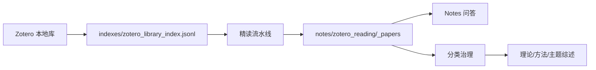

# Architecture

MindCite 采用“索引层 + 笔记层 + 治理层”的结构。

## 数据流

## 模块

- `Zotero-Reading-System`：建立索引、读取全文缓存或 PDF、生成结构化精读笔记。
- `Notes-QA-System`：只基于新版 notes 回答问题。
- `Zotero-Library-Sync`：检查索引、notes 和状态日志之间的一致性。
- `Classification-Governance-System`：生成分类审核队列、标签体系审计和写回 dry-run。
- `Theory-Method-Synthesis-System`：按理论、方法、主题标签生成综述草稿。

## 配置层

所有脚本复用 `_skills/common/mindcite_config.py`。配置优先级：

1. 系统环境变量。
2. `.env`。
3. `config/mindcite.json`。
4. `config/mindcite.example.json`。
5. 当前仓库根目录默认值。

## 扩展原则

- 新数据源先转成统一索引，再进入后续流程。
- 新分类维度要同步更新 taxonomy、frontmatter、queue 和 synthesis。
- 新模型 provider 只修改 reader config 和 provider 调用，不要把 key 写进脚本。
- 写操作默认 dry-run，并保留可审计报告。
