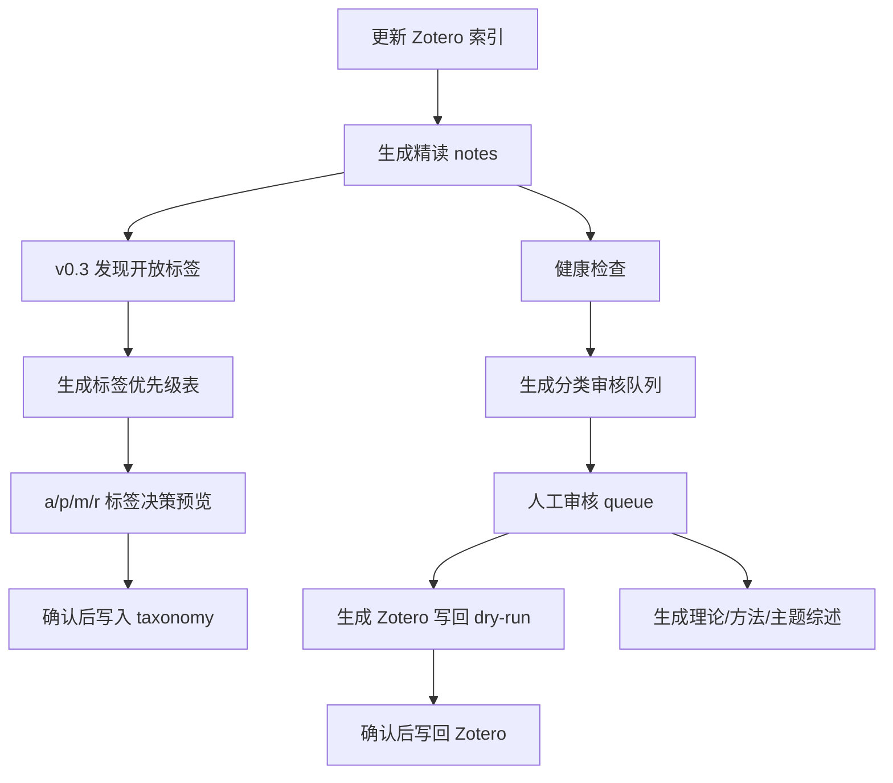

# Classification Guide

MindCite 的分类系统不是单纯给论文打一个标签，而是把 Zotero 分类、Obsidian 笔记 frontmatter、审核队列、标签体系和 Zotero 写回拆成一条可审计流程。

核心原则：

- 先生成建议，再人工审核。
- 默认只写本地报告，不改 Zotero。
- 真实写回 Zotero 前必须 dry-run、备份和显式 `--apply`。
- 分类标签服务研究积累，不追求一次性全自动。

## 分类系统解决什么问题

研究型文献库常见问题：

- Zotero collection 来自 EBSCO、Scopus、SavedRecs、Metadata 等导入路径，不能直接代表研究分类。
- 同一篇论文可能同时属于理论、方法和主题，不适合只放进一个文件夹。
- AI 精读能生成标签，但如果没有审核队列，很容易把错误标签写进长期知识库。
- 综述写作需要按“理论 / 方法 / 主题”聚合 notes，而不只是按 Zotero 文件夹浏览。

MindCite 因此把分类分成三层：

| 层级 | 文件或位置 | 作用 |
| --- | --- | --- |
| Zotero 分类 | Zotero collections | 原始资料组织，可能有导入噪声。 |
| Note frontmatter | `notes/zotero_reading/_papers/*.md` | 每篇精读笔记的理论、方法、主题标签。 |
| Governance queue | `indexes/classification_review_queue.jsonl` | 待审核的分类建议，用于写回或综述。 |

## 三个分类维度

MindCite 默认把文献分类拆成三个维度。

### 理论 theory

回答“这篇文献属于什么理论脉络”。

常见例子：

- 金融传染
- 系统性风险理论
- 资产定价理论
- 汇率决定与 UIP 偏离
- 货币国际化理论

对应 frontmatter 字段：

```yaml
theory_family_tags:
  - "国际金融理论"
theory_tags:
  - "金融传染"
theory_sub_tags: []
```

### 方法 method

回答“这篇文献用了什么模型、识别策略或计量方法”。

常见例子：

- DCC-GARCH
- VAR / SVAR
- 网络分析
- Copula
- DID
- 文本分析

对应 frontmatter 字段：

```yaml
method_family_tags:
  - "波动模型"
method_model_tags:
  - "DCC-GARCH"
method_combo_tags: []
method_tags:
  - "DCC-GARCH"
```

### 主题 topic

回答“这篇文献服务哪个研究问题或应用场景”。

常见例子：

- 国际金融风险
- 汇率风险
- 大宗商品市场
- 气候金融
- 数字货币

对应 frontmatter 字段：

```yaml
topic_family_tags:
  - "国际金融"
topic_tags:
  - "国际金融风险"
```

## 完整分类流程

推荐顺序：



## v0.3 标签体系审计：审标签，不逐篇审论文

早期流程会生成 `classification_review_queue.jsonl`，让你看每篇论文的 theory、method、topic 建议。这在小库里很好用，但当 notes 多起来以后，逐篇审核会很累，也容易把注意力放在个别论文上。

v0.3 的分类治理换成更适合长期维护的做法：先让系统发现“还没进入正式 taxonomy 的开放标签候选”，再由你判断这个标签本身要不要存在。

你只需要回答四类问题：

| 操作 | 含义 | 什么时候用 |
| --- | --- | --- |
| `a` | accept，接受为正式标签 | 这个标签以后会长期用于理论、方法或主题分类。 |
| `p` | pending，暂存观察 | 现在看不准，先不进入正式 taxonomy。 |
| `m` | merge，合并到已有标签 | 这是已有标签的英文名、缩写、同义词或过细变体。 |
| `r` | reject，丢弃进黑名单 | 这是噪声、导入残留、临时词或不适合作为研究标签。 |

### 1. 发现开放标签候选

```powershell
python _skills/Classification-Governance-System/scripts/discover_open_tag_candidates.py --min-notes 1
```

输出：

- `indexes/tag_taxonomy_open_candidates.json`
- `indexes/tag_taxonomy_open_candidates.md`

这一步会扫描新版 notes 的 frontmatter 和少量通用关键词规则，找出“出现在 notes 中，但还不是正式 taxonomy 标签或别名”的候选。它不会修改 notes、taxonomy 或 Zotero。

`--min-notes 1` 适合 demo 或小库；真实库可以改成 `--min-notes 2` 或 `--min-notes 3`，减少偶然噪声。

### 2. 生成优先级审计表

```powershell
python _skills/Classification-Governance-System/scripts/prioritize_open_tag_candidates.py
```

输出：

- `indexes/tag_taxonomy_open_candidate_priority.json`
- `indexes/tag_taxonomy_open_candidate_priority.md`

重点打开 markdown 文件。里面每一行是一个候选标签，核心列如下：

| 列名 | 怎么理解 |
| --- | --- |
| `operation` | 你要做的决策，默认 `p`，可以改成 `a`、`m`、`r`。 |
| `suggested_operation` | 系统建议，不会自动生效。 |
| `label` | 候选标签名。 |
| `source_dimension` | 候选来自 theory、method 还是 topic 字段。 |
| `dimension_choice` | 你确认它最终属于哪个维度，允许跨维度纠正。 |
| `role_choice` | `parent` 父级标签、`child` 子标签、`noise` 噪声。 |
| `level_choice` | 标签层级，例如 `theory_family`、`family`、`topic_family`、`model`、`combo`。 |
| `parent_choice` | 如果是子标签，挂到哪个父级标签下。 |
| `merge_target` | 如果选 `m`，这里写要合并到的正式标签。 |
| `merge_options` | 系统根据相似度和关键词给出的合并候选。 |

### 3. 只做决策预览

改完 markdown 后，先预览：

```powershell
python _skills/Classification-Governance-System/scripts/apply_tag_taxonomy_decisions.py --use-markdown-operations
```

输出：

- `indexes/tag_taxonomy_decision_preview_summary.json`
- `indexes/tag_taxonomy_decision_preview_summary.md`

预览只告诉你“如果应用，会接受几个、合并几个、丢弃几个、暂存几个”，不会真的修改 taxonomy。

### 4. 确认后再应用

只有当 preview 没问题时，才执行：

```powershell
python _skills/Classification-Governance-System/scripts/apply_tag_taxonomy_decisions.py --use-markdown-operations --apply
```

这一步只会改两个文件：

- `indexes/classification_taxonomy.json`
- `indexes/tag_taxonomy_discard_blacklist.json`

它不会写回 Zotero，也不会批量改 notes frontmatter。Zotero 写回仍然必须走 dry-run，并且需要你明确确认。

### 常见决策例子

把候选接受为方法父级：

| operation | label | dimension_choice | role_choice | level_choice | parent_choice |
| --- | --- | --- | --- | --- | --- |
| `a` | `Network connectedness` | `method` | `parent` | `family` |  |

把缩写合并到已有方法标签：

| operation | label | dimension_choice | role_choice | merge_target |
| --- | --- | --- | --- | --- |
| `m` | `connectedness` | `method` | `child` | `method:Network Analysis` |

把噪声丢弃：

| operation | label | dimension_choice | role_choice | decision_note |
| --- | --- | --- | --- | --- |
| `r` | `metadata import` | `topic` | `noise` | `导入来源，不是研究标签` |

## 第一步：更新 Zotero 索引

索引脚本只读 Zotero 数据库，生成：

- `indexes/zotero_library_index.jsonl`
- `indexes/zotero_collection_tree.json`
- `indexes/zotero_index_meta.json`
- `indexes/zotero_index_summary.md`

运行：

```powershell
python _skills/Zotero-Reading-System/scripts/update_zotero_index.py
```

重点看 `zotero_index_meta.json`。例如：

```json
{
  "total_items": 1200,
  "total_collections": 80,
  "fallback_collection_items": 260,
  "missing_pdf_items": 400
}
```

解释：

- `total_items`：被纳入 MindCite 索引的文献条目数。
- `fallback_collection_items`：原始分类像 EBSCO、metadata、savedrecs 等导入噪声，脚本先放到待分类路径。
- `missing_pdf_items`：没有可读 PDF 或全文缓存，后续精读可能会跳过。

## 第二步：生成精读 notes

分类队列主要依赖新版精读笔记，因此建议先生成一小批 notes：

```powershell
python _skills/Zotero-Reading-System/scripts/zotero_ai_reading_pipeline.py --next-count 2
```

如果只是测试，不想调用远程模型：

```powershell
$env:MINDCITE_OFFLINE=1
python _skills/Zotero-Reading-System/scripts/zotero_ai_reading_pipeline.py --next-count 1
Remove-Item Env:\MINDCITE_OFFLINE
```

生成位置：

```text
notes/zotero_reading/_papers/
```

每篇 note 的 frontmatter 会包含分类字段，例如：

```yaml
classification_status: "pending"
classification_audit:
  - "needs_human_review"
```

`classification_status` 不是 Zotero 写回状态，而是这篇 note 的分类可信度状态。建议人工确认后再改为更明确的状态，例如 `reviewed`。

## 第三步：运行健康检查

健康检查用来确认 notes、索引和阅读日志是否一致：

```powershell
python _skills/Zotero-Library-Sync/scripts/vault_health_check.py
```

输出：

- `indexes/vault_health_report.md`
- `indexes/orphan_notes.jsonl`

重点看：

- orphan notes 是否为 0。
- done 状态是否都有对应 note。
- notes 是否缺少分类 frontmatter 字段。

## 第四步：生成分类审核队列

运行：

```powershell
python _skills/Classification-Governance-System/scripts/build_classification_review_queue.py --all
```

输出：

```text
indexes/classification_review_queue.jsonl
```

队列中的每一行大致包含：

```json
{
  "schema_version": "0.2.0",
  "item_key": "DEMO2026A",
  "title": "Demonstration Paper on Global Risk Spillovers",
  "current_zotero_collections": ["3. 理论文献 / 金融传染"],
  "primary_collection": "3. 理论文献 / 金融传染",
  "suggested_theory_tags": ["金融传染"],
  "suggested_method_tags": ["网络分析"],
  "suggested_topic_tags": ["国际金融风险"],
  "evidence_note_path": "notes/zotero_reading/_papers/...",
  "matched_keywords": {},
  "confidence": 0.7,
  "review_status": "pending"
}
```

字段解释：

- `current_zotero_collections`：当前 Zotero 中已有分类。
- `primary_collection`：MindCite 判断的主要路径。
- `suggested_theory_tags`：建议写入理论分类的标签。
- `suggested_method_tags`：建议写入方法分类的标签。
- `suggested_topic_tags`：建议写入主题分类的标签。
- `evidence_note_path`：建议来自哪篇精读 note。
- `matched_keywords`：命中哪些 taxonomy 关键词。
- `confidence`：规则匹配置信度，不等于研究判断。
- `review_status`：人工审核状态，默认 `pending`。

## 第五步：人工审核队列

打开：

```text
indexes/classification_review_queue.jsonl
```

逐行检查：

1. `title` 是否是你要处理的论文。
2. `evidence_note_path` 对应 note 是否可靠。
3. `suggested_*_tags` 是否符合你的研究理解。
4. `current_zotero_collections` 是否已有正确路径。
5. `confidence` 低的条目优先人工看。

审核后可以手动改：

```json
"review_status": "approved"
```

不建议直接批量把所有 `pending` 改成 `approved`。更稳的方式是先审核 20 到 50 篇，确认 taxonomy 合理后再扩大范围。

## 第六步：生成 Zotero 写回 dry-run

先生成写回计划：

```powershell
python _skills/Classification-Governance-System/scripts/build_zotero_writeback_dryrun.py --approved-only
```

输出：

```text
indexes/zotero_writeback_dryrun.jsonl
```

每一行会说明：

- 要给哪个 `item_key` 添加分类。
- 要添加哪些 `add_collection_paths`。
- 目标 collection 是否已经存在。
- 是否会删除原分类。

当前 MindCite 的原则是：

```text
只添加分类，不删除 Zotero 现有分类。
```

也就是说 `will_remove_collections` 应该保持 `false`。

## 第七步：预览写回结果

不带 `--apply` 时，只预览，不写 Zotero：

```powershell
python _skills/Classification-Governance-System/scripts/apply_zotero_writeback_sqlite.py --limit 5
```

输出：

- `indexes/zotero_sqlite_writeback_report.jsonl`
- `indexes/zotero_sqlite_writeback_summary.md`

这一步应该检查：

- `preview` 数量是否符合预期。
- `errors` 是否为 0。
- `will_remove_collections` 是否为 `false`。
- `backup_path` 为空，因为还没有真实 apply。

## 第八步：确认后写回 Zotero

只有你确认 dry-run 正确，且已经关闭 Zotero，才执行：

```powershell
python _skills/Classification-Governance-System/scripts/apply_zotero_writeback_sqlite.py --apply --limit 5
```

安全要求：

- 先关闭 Zotero。
- 第一次只用 `--limit 5`。
- 确认 Zotero 中分类结果正确后再扩大范围。
- 写回前脚本会备份 `zotero.sqlite`。
- 如果不确定，不要执行 `--apply`。

## 标签体系 taxonomy

分类建议来自 taxonomy。默认路径：

```text
indexes/classification_taxonomy.json
```

如果这个文件不存在，脚本会使用内置默认 taxonomy。建议你为自己的研究库维护一个正式 taxonomy。

仓库内置了一个“金融研究版”合成示例：

```text
examples/demo-vault/indexes/classification_taxonomy.json
```

你可以把这个文件复制到自己的私有 Vault 的 `indexes/classification_taxonomy.json`，再按自己的研究方向删减和改名。它只是通用示例，不代表任何个人研究判断。

基本结构：

```json
{
  "schema_version": "0.2.0",
  "version": "finance-2026-01",
  "source": "user-maintained",
  "dimensions": {
    "theory": [
      {
        "label": "金融传染",
        "target_collection_base": "3. 理论文献",
        "target_collection_path": "3. 理论文献 / 金融传染",
        "keywords": ["financial contagion", "risk spillover", "金融传染", "风险溢出"],
        "negative_keywords": []
      }
    ],
    "method": [],
    "topic": []
  }
}
```

字段说明：

- `label`：标准标签名，应该短且稳定。
- `target_collection_base`：默认写回到 Zotero 的一级路径。
- `target_collection_path`：可选的精确目标路径。
- `keywords`：匹配标题、摘要、note frontmatter 和摘录的关键词。
- `negative_keywords`：用于排除误匹配。

## 如何设计一个好 taxonomy

建议从小开始：

```text
理论 10-20 个
方法 10-20 个
主题 10-30 个
```

不要一开始就建几百个标签。分类体系太细会带来三个问题：

- AI 和规则更容易误判。
- 人工审核成本变高。
- 后续综述聚合时每个标签下论文太少。

一个好标签应该满足：

- 你未来会按它检索或写综述。
- 它能对应清晰的 Zotero collection。
- 它不是临时情绪化描述。
- 它和同维度其他标签边界清楚。

## 标签体系审计

生成 taxonomy 提案：

```powershell
python _skills/Classification-Governance-System/scripts/build_tag_taxonomy_proposal.py
```

生成审计报告：

```powershell
python _skills/Classification-Governance-System/scripts/build_tag_taxonomy_audit.py
```

常见输出：

- `indexes/audited_tag_taxonomy_proposal.json`
- `indexes/audited_tag_taxonomy_proposal.md`
- `indexes/tag_taxonomy_current.md`
- `indexes/tag_taxonomy_audit.md`

这些文件用于回答：

- 当前 notes 里哪些标签最常出现。
- 哪些标签可能重复。
- 哪些标签只有一两篇文献，是否过细。
- 哪些标签缺少证据样本。

## 用分类生成综述

当 notes 已经有稳定分类字段后，可以按维度生成综述草稿：

```powershell
python _skills/Theory-Method-Synthesis-System/scripts/build_classification_synthesis.py --dimension theory --tag 金融传染
python _skills/Theory-Method-Synthesis-System/scripts/build_classification_synthesis.py --dimension method --tag DCC-GARCH
python _skills/Theory-Method-Synthesis-System/scripts/build_classification_synthesis.py --dimension topic --tag 国际金融风险
```

输出：

```text
notes/classification_synthesis/
```

这些综述是草稿，不是最终论文文本。建议用它们来做：

- 文献脉络梳理。
- 理论机制对比。
- 方法使用清单。
- 研究空白识别。

## 推荐的稳定工作节奏

第一次使用：

```powershell
python _skills/Zotero-Reading-System/scripts/update_zotero_index.py
python _skills/Zotero-Reading-System/scripts/zotero_ai_reading_pipeline.py --next-count 5
python _skills/Zotero-Library-Sync/scripts/vault_health_check.py
python _skills/Classification-Governance-System/scripts/build_classification_review_queue.py --all
```

人工审核 5 到 20 篇后：

```powershell
python _skills/Classification-Governance-System/scripts/build_zotero_writeback_dryrun.py --approved-only
python _skills/Classification-Governance-System/scripts/apply_zotero_writeback_sqlite.py --limit 5
```

确认无误后，再考虑：

```powershell
python _skills/Classification-Governance-System/scripts/apply_zotero_writeback_sqlite.py --apply --limit 5
```

## 常见错误

### 一上来就写回 Zotero

不要。先 dry-run，再小批量 `--apply`。

### taxonomy 太细

标签越细，误判越多。先用中等粒度，后续再拆分。

### 把导入来源当研究分类

`EBSCO导入`、`Scopus导入`、`SavedRecs导入`、`Metadata导入` 只代表来源，不代表研究主题。

### 只按主题分类

研究库最好同时保留理论、方法和主题。否则后续写文献综述时，很难回答“这类问题通常用什么模型”和“这类模型服务什么理论”。

### 不看 evidence

分类建议必须回到 `evidence_note_path` 看证据。`confidence` 只是规则置信度，不是学术正确性。

## 最小安全规则

把这几条当成硬规则：

- `classification_review_queue.jsonl` 是建议，不是事实。
- `zotero_writeback_dryrun.jsonl` 是计划，不是执行结果。
- 不带 `--apply` 不会真实写回 Zotero。
- 第一次 `--apply` 必须加 `--limit 5`。
- 任何真实写回前先关闭 Zotero。
- 任何分类体系调整后，先重新生成 queue，再重新 dry-run。
